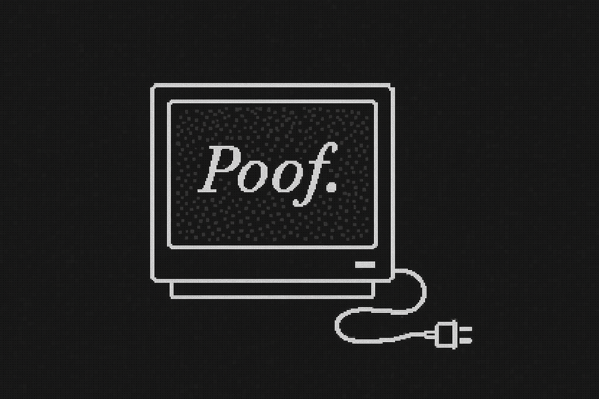

_Poof_ is a set of tools to help build applications that require a zero-knowledge proving system using public verifiability.

## How it works

A prover generates a proof and submits calldata to the verifier contract which uses the [arkworks](https://arkworks.rs/) ecosystem of libraries to verify Groth16 zkSNARK proofs over the BN254 curve. The contract returns "true" if the the proof is valid. 

The example circuit being used is a simple multiplication circuit a * b = c whereby the value c is publicly known and the prover proves they know values a and b without revealing them.

There are two types of users:

- Users deploying the verifier system. To do this, run the provided script `deploy_verifier.sh`.
- Users who want to generate a proof to submit to a known verifier. To do this, run `generate_proof_offline.sh`.

### Proving system 

- A user (prover) who knows a and b such that a * b = c calls `cargo run -- prove --a 3 --b 4 --c 12`
- Generates a Groth16 proof using the proving key (128 bytes), serializes the proof (128-bytes) and public input c (32 bytes) and writes a 164-byte ABI-compatible calldata
- The user sends a call to a deployed contract: `cast call $VERIFIER_CONTRACT --data 0x$(xxd -p calldata.bin | tr -d '\n')`
- The verifier contract deserializes the proof and input and reconstructs the verifying key from the embedded bytes and returns a 32-byte bool (true = valid, false = invalid)

### Verifier contract 

- `prover/src/circuit.rs` defines a constraint system (e.g., a * b = c) using ark-r1cs.
- `ark-groth16::generate_random_parameters_with_reduction()` is used to generate:
   - A `ProvingKey` (which contains toxic waste values in obfuscated form).
   - A `VerifyingKey` (which is public and goes on-chain).
- The verifying key is embedded into a Rust contract targeting the Polkadot Virtual Machine (PVM).
- The Rust contract deserializes the proof and verifying key and performs the verification.

A Solidity wrapper contract designed to call into the Rust contract provides the entry point for application interfaces to submit proofs and make it easy to extend any user facing business logic.

## Assumptions

- You as a developer runs the trusted setup, implying a trust assumption. That being said, with ark-groth16 `generate_random_parameters_with_reduction` you'd have to modify the function in order to expose the toxic waste.
- Users generate their own proofs offchain.
- Contract contains the correct verifying key (VK) and wasn't tampered with.
- Prover and verifier must agree on the exact circuit logic, its for the application-specifc business logic to define how incentives can be best aligned.

##  Challenges
- needing to use an allocator in the rust contrat to verify the proof
- global allocator would make it possible for any inputs 
- however without it we cannot expect variable proof sizes or keys. /Your use case is fixed-circuit (same verifying key forever).
- Even a dummy allocator (like one returning null_mut()) will not work, because the PVM trap system interprets any such call as undefined memory behavior, and your contract gets ContractTrapped.
- All deserialization, proof verification, and cryptographic work must not allocate at runtime.

## CLI

The library comes with a CLI tool to easily pass in inputs for generating proofs and verification locally.

Run proof:

```sh
cargo run -p zkcli prove --a 3 --b 4 --c 12
```

Verify proof:

```sh
cargo run -p zkcli -- \
  verify \
  --proof  ../proofs/proof.bin \
  --input  ../proofs/public_input.bin \
  --vk     ../keys/verifying_key.bin
```

## Features

- **You can adjust the contract heap size to your needs.** The script A 512 KiB static heap costs code-space and deploy gas; if the high-water mark is only 140 KiB you can safely drop the constant to 192 KiB and cut contract size/gas.

## Application circuits to explore

### Games

**"You can come camping"**. Verifier contract is deployed by the "leader" who crafts a circuit according to their constraint. A Solidity contract handles the game logic such as duration of rounds, minimum number of proofs to be "allowed to come camping", rewards etc. Leader can deploy the verifier along with a clue (e.g. constraint is that it must be a three letter word and the clue is "one, two, ?"). Circuit implementation can get fancy by constaining a circuit to a list of words from a specific category.
This could even be a game where the business logic (on the Solidity side) allows the "leader" to deposit an amount of funds that provers can win if they submit the correct proofs. And provers also deposit a small amount to play which get put in the pot of funds where some disbursement mechanism ensures fair distribution of funds.

**"Word to mouth inviations"**. Verifier contract is deployed designed to verify whether a prover has a specific code. Business logic handles sending invites out. Codes are only given offline, word to mouth to invitees. The app sends an invitation NFT for participants who submit correct proofs.


**"Deniable messaging"**. 


## Future direction

- Add different proving signature schemes to the `prover` library.
- Add functionality to launch p2p relayers

### Make it easy to add new circuits

To add new circuits you'd define them in `proof/src/circuits.rs`:

```rust
use ark_relations::r1cs::ConstraintSynthesizer;
use ark_bn254::Fr;

pub trait CircuitDefinition {
    fn name(&self) -> &'static str;
    fn setup_instance(&self) -> Box<dyn ConstraintSynthesizer<Fr>>;
    fn proving_instance(&self) -> Box<dyn ConstraintSynthesizer<Fr>>;
    fn public_inputs(&self) -> Vec<Fr>;
}
```

```rust
const HEAP_SIZE: usize = 256 * 1024;
static mut HEAP: [u8; HEAP_SIZE] = [0; HEAP_SIZE];
static mut OFFSET: usize = 0;

struct Bump;

unsafe impl core::alloc::GlobalAlloc for Bump {
    unsafe fn alloc(&self, layout: core::alloc::Layout) -> *mut u8 {
        let align = layout.align();
        let size  = layout.size();
        let mut cur = OFFSET;

        // align
        let mis = cur % align;
        if mis != 0 { cur += align - mis; }

        if cur + size > HEAP_SIZE { return core::ptr::null_mut() }
        let ptr = HEAP.as_mut_ptr().add(cur);
        OFFSET = cur + size;
        ptr
    }
    unsafe fn dealloc(&self, _p: *mut u8, _l: core::alloc::Layout) {}
}

#[global_allocator]
static ALLOC: Bump = Bump;

#[alloc_error_handler]
fn oom(_: core::alloc::Layout) -> ! {
    // graceful PolkaVM trap
    unsafe { core::arch::asm!("unimp"); core::hint::unreachable_unchecked() }
}
```

Fix:
- 1. Ensure all deserialization uses fixed-size buffers
- Ark-works uses smallvec internally so heap is needed

## Architecture

```ascii

[User Device / CLI]
   |
   | 1. Inputs:
   |   - message: "The eagle lands at dawn"
   |   - recipient: @agent47
   |
   ▼
╭────────────────────────────╮
│        Prover CLI Tool     │  ◄── `zkcli prove --message "..." --recipient ...`
│  (ephemeral encryption +   │
│   zkSNARK generation)      │
╰────────────┬───────────────╯
             │
             │ Output: `spirit box`
             │   {
             │     proof,
             │     ephemeral_pubkey,
             │     ciphertext (AES-GCM),
             │     recipient_id,
             │     optional commitment hash
             │   }
             │
             ▼
  ╭──────────────────────────────────╮
  │     Spirit Box Delivery Layer    │  ◄── P2P, Matrix, Whisper, IPFS, contract mailbox
  ╰──────────────────────────────────╯
             │
             ▼
  ╭──────────────────────────────────╮
  │        Recipient Client App      │  ◄── recipient opens spirit box
  │ - Uses their secret key          │
  │ - Decrypts message via ECDH + AES│
  │ - Simulates SNARK verifier       │
  │   to privately verify sender     │
  ╰──────────────────────────────────╯
             │
             ▼
╭────────────────────────────────────────────────╮
│  [Optional] Public Verifiability (on-chain)    │
│   - Recipient hashes message + proof           │
│   - Submits proof to contract (PVM)            │
│   - Verifier returns true/false                │
╰────────────────────────────────────────────────╯
```

## UX Overview

For Poof, the zk-seance deniable messaging app, I envision a UX around using a simple mailbox. 

- **Magic Box & Keys**: Sender generates a one-time (ephemeral) keypair and encrypts the message under a shared secret (Diffie–Hellman with the receiver’s long-term public key). Receiver holds a long-term private key that both derives the shared secret and verifies proofs.
- **Invisible Stamp (ZK Proof)**: Sender attaches a zero-knowledge proof (“the stamp”) attesting that the ciphertext was correctly formed under their ephemeral key and the receiver’s public key. This is a designated-verifier proof: only the receiver can check it, and only they can simulate identical proofs themselves
- **Mailbox Notification**: When the sender pushes (epk, C, Π) to the relay/server for the receiver, the server marks “unread” for that mailbox. A WebSocket event flips the on-screen mailbox lamp from “off” to “glowing,” letting the receiver know there’s something waiting.
- **Opening & Reading**: Receiver clicks the mailbox, uses their private key to verify the proof, and—if valid—decrypts the message. All this happens without leaking sender identity or message contents to anyone else.

## Future plans

### Turn into self hosted app

Make it a self-hosted P2P based app so that users can send messages on the network, store messages locally, have better key management and use verifier periodically. 

```ascii
             +----------------------+
             |   Client App &      |
             |   libp2p Node       |
             |  • PubSub Subscribe |
             |  • Local Store      |
             +----------------------+
                       │
         (1) Publish   │  zk‐boxed message
          epk,C,Π      ▼
             +----------------------+
             |  Relay libp2p Node   |
             |  • PubSub Gossip     |
             |  • Simple Store      |
             +----------------------+
                       │
    (2) Gossip & cache │
                       ▼
             +----------------------+
             | Client App &        |
             | libp2p Node         |
             | • Receive & Store   |
             | • Notify UI         |
             +----------------------+
                       │
        (3) User taps  │
        “Open Box”     ▼
             +----------------------+
             | Offchain Prover     |
             | • Generate Π        |
             | • Export VK / CRS   |
             +----------------------+
                       │
           (4) Verify & decrypt  
                       ▼
             +----------------------+
             |  Verifier Contract   |
             |  (optional on‐chain) |
             +----------------------+
```


